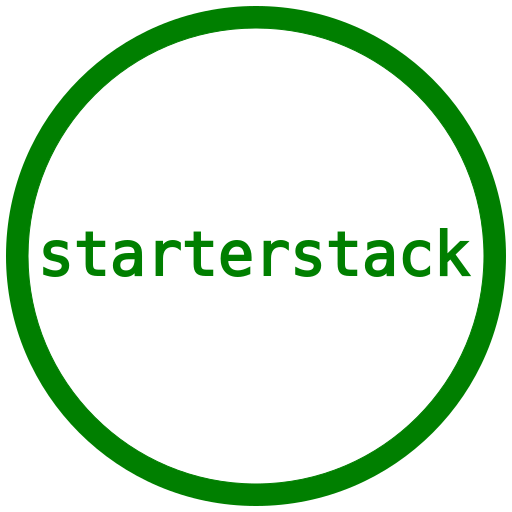
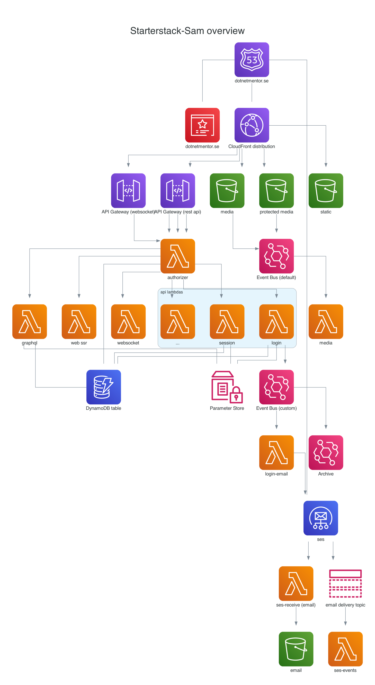
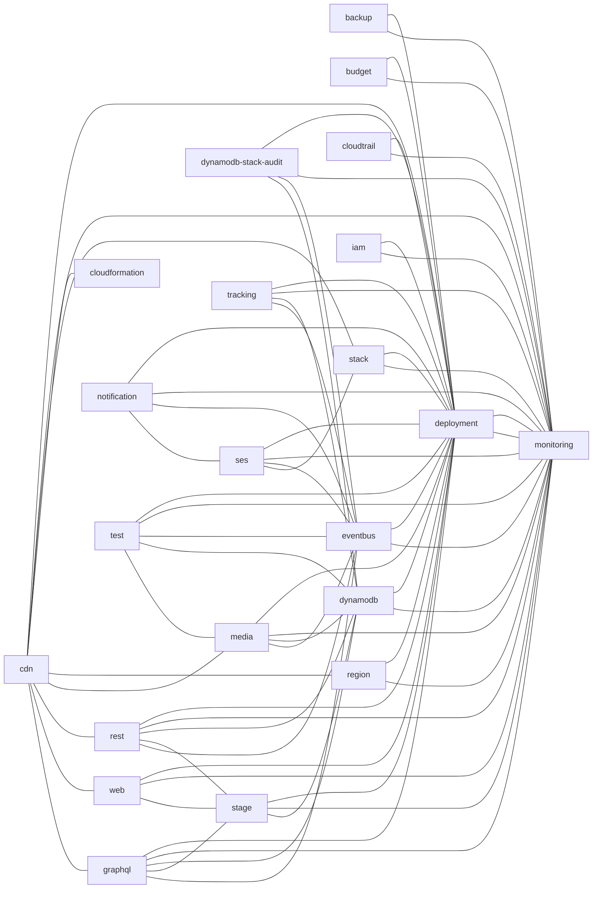

# ⚡ serverless monorepo stack ⚡

[](https://github.com/starterstack/starterstack/actions/workflows/build-actions-dist.yml)
[](https://github.com/starterstack/starterstack/actions/workflows/dev.yml)
[](https://github.com/starterstack/starterstack/actions/workflows/release-please.yml)
[](https://github.com/starterstack/starterstack/actions/workflows/log.yml)
[](https://github.com/starterstack/starterstack/actions/workflows/backup.yml)

This project was bootstrapped with [starterstack](https://github.com/starterstack/starterstack), a Serverless monorepo template architecture. 

### OS support for local development

- Windows (WSL or Git Bash)
- macOS including M1
- Linux

### Prerequisites

- [Node 20](https://nodejs.org/en/download/)
- [Python 3.12](https://www.python.org/downloads/release/python-3121)
- [graphviz](https://graphviz.gitlab.io/download/) to generate [docs](./docs/README.md)
- [sam cli](https://github.com/aws/aws-sam-cli) to deploy locally
- [aws cli](https://docs.aws.amazon.com/cli/latest/userguide/getting-started-install.html#getting-started-install-instructions) to deploy locally
- [jq](https://github.com/jqlang/jq) to deploy locally

### Developer tool prerequisites if not using [Docker](https://www.docker.com)

- [go](https://go.dev/doc/install) Go for shfmt
- [shfmt](https://github.com/mvdan/sh) to format shell scripts
- [black](https://github.com/psf/black) to format python

### Windows Git Bash prerequisites

- [Git Bash](https://gitforwindows.org/) make sure symbolic links are enabled
- [git clone -c core.symlinks=true](https://stackoverflow.com/questions/5917249/git-symbolic-links-in-windows)

### Recommended

- [nvm](https://github.com/nvm-sh/nvm)
- [direnv](https://direnv.net/)

### Roadmap

- [x] Template repository with quick setup script
- [x] CloudFront CDN supporting static, dynamic, private content, REST API (REST, GraphQL + subscriptions), and WebSockets
- [x] Optional WAF (REST API, CloudFront)
- [x] Create React App with SSR support, protected assets and sourcemaps
- [x] Direct S3 file uploads
- [x] Image resizing example (jpeg, and webp)
- [x] PDF example
- [x] CloudFront functions
- [x] Custom Lambda Authorizers for HTTP API, REST API & Websockets using JWT and DynamoDB with user roles
- [x] X-Ray tracing, sampled debug logging, and correlationId tracing
- [x] Examples for DynamoDB, SES (sending and receiving), SNS, SSM, S3, EventBridge
- [x] Custom CloudFormation resource supporting SES automation
- [x] Language and device support for content
- [x] Single AWS account, and AWS account per stage support
- [x] DynamoDB streams
- [x] DynamoDB migrations
- [x] EventBridge Pipes
- [x] Sanity tests with Step Functions
- [x] 100% [SAM](https://aws.amazon.com/serverless/sam/) templates
- [x] No Terraform
- [x] No Lambda Containers
- [x] Deploy using [sam-expand](https://github.com/starterstack/sam-expand#readme)
- [x] Github Action deploys using the principle of least privilege
- [x] Infrastructure audit using [sls-mentor](https://www.sls-mentor.dev/)
- [x] Feature branch deployment support
- [x] IAM role for deployment using OpenID Connect (no aws keys needed)
- [x] Manual DNS entry of Nameservers
- [x] Node, and Python examples
- [x] Budget alerts to SNS and Slack
- [x] Optional CloudWatch alarms
- [x] Sentry integration

### Git commits

Commit messages are [Commitizen friendly](https://github.com/commitizen/cz-cli#making-your-repo-commitizen-friendly)

`npx cz` or `npm run cz` should be used instead of `git commit`

### License

[Apache License, Version 2.0](LICENSE)

### :house: development

proxy to deployed environment, or local without react

```sh
npm run proxy
```

- GraphQL - You can use [apollo studio](https://studio.apollographql.com/sandbox/explorer)
  and connect it to a local running graphql server without exposing a playground.

deploy without GitHub actions

```sh
npm i
```

run unit tests

```sh
npm t
```

```sh
npm run deploy
```

### Initial AWS setup

- [create repository](https://github.com/new) from starterstack repository template
- create a [starterstack PAT](https://github.com/settings/tokens) (personal access token) with (repo, write:packages, and delete:packages)
  make a note of the value, this will be used to cleanup feature deployments
- install [prerequisites](https://github.com/starterstack/starterstack#prerequisites)
- git clone
- `cd starterstack`
- ```sh
  npm i
  npm run setup # add the PATs, select generate random values for the API secrets, AWS secrets are to be skipped for now
  ```
- push changes
- deploy deployment, monitoring, iam and stack on each AWS account to be used by each stage
  deploy log account first, then backup, then the others
  ```sh
  launch AWS CloudShell in the AWS console
  git clone https://github.com/starterstack/starterstack.git
  <your username>
  <your PAT with read permissions or password>
  cd starterstack
  npm ci --ignore-scripts --omit=dev
  # if cloudshell runs out of space use `npm run cli` with AWS credentials instead
  cd packages/deployment
  npx sam-expand build
  # optional lint check (supplied by build output)
  npx sam-expand deploy
  cd -
  cd packages/monitoring
  npx sam-expand build
  # optional lint check (supplied by build output)
  npx sam-expand deploy
  cd -
  cd packages/iam
  npx sam-expand build
  # optional lint check (supplied by build output)
  npx sam-expand deploy
  cd -
  cd packages/stack # skip this step for log and backup accounts
  npx sam-expand build
  # optional lint check (supplied by build output)
  npx sam-expand deploy
  # when the stack is being created access aws console, and follow the DNS instructions below
  cd -
  cd packages/cloudtrail # for log account only
  npx sam-expand build
  # optional lint check (supplied by build output)
  npx sam-expand deploy
  cd -
  cd packages/backup # for backup account only
  npx sam-expand build
  # optional lint check (supplied by build output)
  npx sam-expand deploy
  # if log or backup account run `npm run setup # GitHub secrets only` to save s3 bucket to secrets from cloudformation output
  ```
- when backup and log are deployed with sam-expand, push changes and wait for GitHub actions before continuing
- skip following dns steps for log and backup accounts
- make note of the name servers in `route53`
- shorten all `TTL` in both your `DNS provider` and `route53` for all non prod accounts
- add `NS` records for `dev.`, `feature.`, and `root domain` in your DNS provider
  this may take some time to propagate
- setup GitHub secrets
  ```sh
  # for log and backup make sure you have the correct credentials if not using cloudshell, and that you select log, or backup for `Update secrets for stage` prompt
  npm run setup # skip to secrets only, use the PAT value from above, select generate random values for the API secrets, select use cloudformation for ci roles
  ```
- ```sh
  git push
  ```
- enable [security, and dependabot settings](https://github.com/starterstack/starterstack/security)
- to send mails with SES you'll need to [request SES production access](https://docs.aws.amazon.com/ses/latest/dg/request-production-access.html) on (dev, prod, and test accounts)

### CI/CD

Deployment with `npx sam-expand` using GitHub actions.

See [deployments](https://github.com/starterstack/starterstack/deployments) for active environments.

Merge [release please pull requests](https://github.com/googleapis/release-please) before deploying to production, they are in the format `chore(main): release x`

- deploy `PR` to own stage with optional label `feature deploy`
- each push to main deploys to `dev` stage
- deploy to production by running workflow [main.yml](./.github/workflows/main.yml) with (stage: prod, account: production)

### Shared javascript code

Common javascript code is found in packages/shared.

To use any of the files in the lambda use symlinks, add the dependencies to the function, and to root as a devDependency.

```sh
ln -s <js file path to shared file> <js file path in lambda function>
```

### Cloud Nuke :fire:

Before running [cloud-nuke](https://github.com/gruntwork-io/cloud-nuke) we should remove our CloudFormation stacks.

- run delete feature workflow for all environments on account to nuke
- launch AWS CloudShell in the AWS console
  ```sh
  launch AWS CloudShell in the AWS console
  git clone https://github.com/starterstack/starterstack.git
  <your username>
  <your PAT with read permissions or password>
  cd starterstack
  npm ci --ignore-scripts --omit=dev
  # possible manual intervension required to succesfully delete CloudFormation stacks
  cd packages/stack
  npx sam-expand delete
  cd ../iam
  npx sam-expand delete
  ```
- if you want to recreate refer to the [Initial setup section](https://github.com/starterstack/starterstack#initial-setup)

### Tags

All resources are tagged with `ManagedBy` starterstack, and `Name`

It's a good idea enabling these using [Cost Allocation Tags](https://docs.aws.amazon.com/awsaccountbilling/latest/aboutv2/cost-alloc-tags.html)

If and when new resource types are added, missing tags can be detected using [Tag Editor](https://docs.aws.amazon.com/ARG/latest/userguide/tag-editor.html)

The extra work to tag resources is as follows

- [tag eventbus rules script (not supported yet in CloudFormation)](./scripts/tag-eventbus-rules.sh)
- [default tags are defined here](./packages/stack-stage-config.mjs)

### Manually deleting a CloudFormation stack

GitHub workflows won't detect git commits including deletion of entire cloudformation stacks, CloudShell can be used to remove the stacks manually.

```sh
launch AWS CloudShell in the AWS console
git clone https://github.com/starterstack/starterstack.git
<your username>
<your PAT with read permissions or password>
cd starterstack
git checkout <commit prior to delete>
npm ci --ignore-scripts --omit=dev
cd packages/<stack to delete>
npx sam-expand remove
```

### DynamoDB

createdAt, createdBy, modifiedBy, modifiedAt are automatically added to write queries in [dynamodb.js](./packages/shared/dynamodb.js) using [aws-sdk-v3's middleware stack](https://aws.amazon.com/blogs/developer/middleware-stack-modular-aws-sdk-js/), userId is populated from correlationIds.

### Overview

Overview diagram



CloudFormation stacks



UML diagrams

drag [drawio file](./docs/uml/drawio.svg) to [app.diagrams.net](https://app.diagrams.net/)

Interactive documentation using [structurizr](https://structurizr.com).

- diagrams use the [c4 model](https://c4model.com).
- markdown files in [./docs/structurizr/doc](./docs/structurizr/doc) are served as documentation.
- architectural descision record files in [./docs/structurizr/doc/adr](./docs/structurizr/doc/adr).
- documentation uses [structurizr/lite](https://structurizr.com/help/lite).

To run then structurizr documentation run `npm run docs`

To create new architectural descision record files use the [adr cli](https://github.com/npryce/adr-tools).

The [workspace dsl file](./docs/structurizr/workspace.dsl) using [structurizr dsl format](https://structurizr.com/dsl) contains the diagram dsl.
