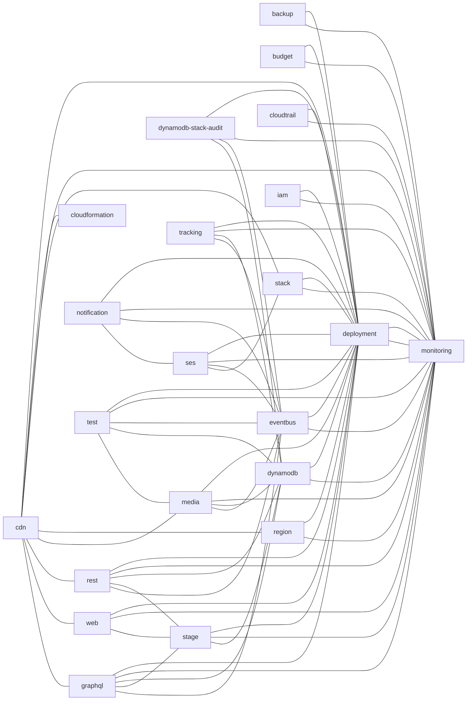

# ⚡ serverless monorepo stack ⚡

# WIP

This project was bootstrapped with [starterstack](https://github.com/starterstack/starterstack), a Serverless monorepo template architecture. 

### OS support for local development

- Windows (WSL or Git Bash)
- macOS including M1
- Linux

### Prerequisites

- [Node 20](https://nodejs.org/en/download/)
- [Python 3.12](https://www.python.org/downloads/release/python-3121)
- [graphviz](https://graphviz.gitlab.io/download/) to generate [docs](./docs/README.md)
- [sam cli](https://github.com/aws/aws-sam-cli) to deploy locally
- [aws cli](https://docs.aws.amazon.com/cli/latest/userguide/getting-started-install.html#getting-started-install-instructions) to deploy locally
- [jq](https://github.com/jqlang/jq) to deploy locally

### Developer tool prerequisites if not using [Docker](https://www.docker.com)

- [go](https://go.dev/doc/install) Go for shfmt
- [shfmt](https://github.com/mvdan/sh) to format shell scripts
- [black](https://github.com/psf/black) to format python

### Windows Git Bash prerequisites

- [Git Bash](https://gitforwindows.org/) make sure symbolic links are enabled
- [git clone -c core.symlinks=true](https://stackoverflow.com/questions/5917249/git-symbolic-links-in-windows)

### Recommended

- [nvm](https://github.com/nvm-sh/nvm)
- [direnv](https://direnv.net/)

CloudFormation stacks

UML diagrams

drag [drawio file](./docs/uml/drawio.svg) to [app.diagrams.net](https://app.diagrams.net/)

Interactive documentation using [structurizr](https://structurizr.com).

- diagrams use the [c4 model](https://c4model.com).
- markdown files in [./docs/structurizr/doc](./docs/structurizr/doc) are served as documentation.
- architectural descision record files in [./docs/structurizr/doc/adr](./docs/structurizr/doc/adr).
- documentation uses [structurizr/lite](https://structurizr.com/help/lite).

To run then structurizr documentation run `npm run docs`

To create new architectural descision record files use the [adr cli](https://github.com/npryce/adr-tools).

The [workspace dsl file](./docs/structurizr/workspace.dsl) using [structurizr dsl format](https://structurizr.com/dsl) contains the diagram dsl.
