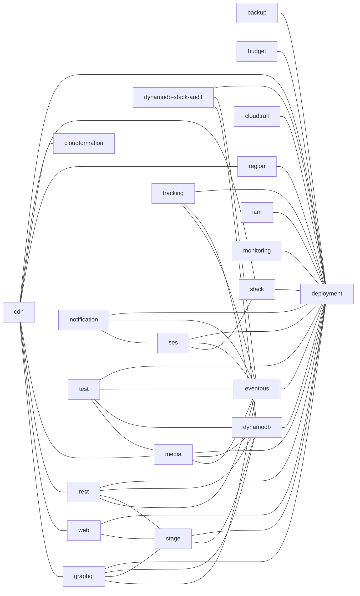

# ⚡ serverless monorepo stack ⚡

WIP

CloudFormation stacks

```mermaid
  graph LR;
    backup --- deployment
    budget --- deployment
    cdn --- deployment
    cdn --- stack
    cdn --- cloudformation
    cdn --- region
    cdn --- media
    cdn --- rest
    cdn --- web
    cdn --- graphql
    cloudtrail --- deployment
    dynamodb --- deployment
    dynamodb-stack-audit --- deployment
    dynamodb-stack-audit --- eventbus
    dynamodb-stack-audit --- dynamodb
    eventbus --- deployment
    graphql --- deployment
    graphql --- dynamodb
    graphql --- stage
    graphql --- eventbus
    iam --- deployment
    media --- deployment
    media --- dynamodb
    media --- eventbus
    monitoring --- deployment
    notification --- deployment
    notification --- eventbus
    notification --- ses
    region --- deployment
    rest --- deployment
    rest --- dynamodb
    rest --- stage
    rest --- eventbus
    ses --- deployment
    ses --- eventbus
    ses --- stack
    stack --- deployment
    stage --- deployment
    stage --- dynamodb
    test --- deployment
    test --- eventbus
    test --- dynamodb
    test --- media
    tracking --- deployment
    tracking --- dynamodb
    tracking --- eventbus
    web --- deployment
    web --- stage
```
